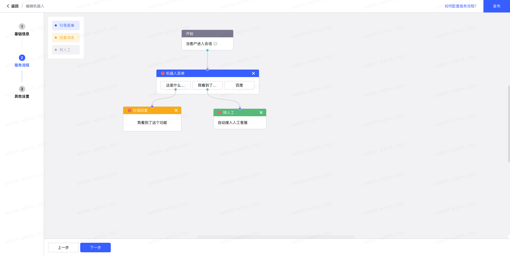

# @antv/x6 在 vue2 中的使用

## 写在前面

因为工作需要，写了一个拖拽流程图生成组件。用的是 AntV-X6，本文记录了基本使用方法以及具体功能的实现。

## 实现功能

- 可以拖拽添加节点，修改编辑节点样式

- 节点数量限制

- 可以添加连线，修改连线的样式，删除连线

- 输入输出桩的配置、连接数量控制以及连接校验

- 限制节点之间的连接

- 父子节点相关内容

- 数据回显

## 项目界面展示



## 安装依赖

```js
npm i @antv/x6 @antv/x6-vue-shape @vue/composition-api

// or

yarn add @antv/x6 @antv/x6-vue-shape @vue/composition-api
```

## 相关配置

```js
const self = this;
const containerRef = this.$refs.containerRef;

const graph = new Graph({
  container: containerRef, // 画布的容器
  selecting: true,
  snapline: true, // 对齐线
  history: true, // 启动历史记录
  background: {
    color: "#f4f4f6",
  },
  panning: true, // 可以拖拽平移
  allowLoop: false,
  // 定制节点和边的交互行为
  interacting: (cellView) => {
    // disabledMove为true的节点不可移动
    if (
      cellView.cell.getData() !== undefined &&
      cellView.cell.getData().disabledMove
    ) {
      return {
        nodeMovable: false,
      };
    }
    return true;
  },
  // Scroller 使画布具备滚动、平移、居中、缩放等能力
  scroller: {
    enabled: true,
    pageVisible: true,
    pageBreak: true,
    pannable: true,
  },
  // 鼠标滚轮的默认行为是滚动页面
  mousewheel: {
    enabled: true,
    modifiers: ["ctrl", "meta"],
    minScale: 0.5,
    maxScale: 2,
  },
  // 节点连接
  connecting: {
    anchor: "center",
    connectionPoint: "anchor",
    snap: true, // 自动吸附
    allowBlank: false, // 是否允许连接到画布空白位置的点
    allowLoop: false, // 是否允许创建循环连线，即边的起始节点和终止节点为同一节点
    allowNode: false, // 是否允许边链接到节点（非节点上的链接桩）
    allowMulti: false,
    sourceAnchor: "bottom",
    highlight: true,
    createEdge() {
      return new Shape.Edge({
        attrs: {
          line: {
            stroke: "#D7D7D7",
            strokeWidth: 2,
            targetMarker: {
              name: "classic",
              size: 8,
            },
            strokeDasharray: 0, //虚线
            style: {
              animation: "ant-line 30s infinite linear",
            },
          },
        },
        label: {
          text: "",
        },
        connector: "algo-connector",
        router: {
          name: "orth",
        },
      });
    },
    // 点击 magnet 时 根据 validateMagnet 返回值来判断是否新增边，
    // 触发时机是 magnet 被按下，如果返回 false，则没有任何反应，
    // 如果返回 true，会在当前 magnet 创建一条新的边。
    // 当前输出链接桩已连接的数量大于定义的数量则不可创建新的边
    validateMagnet({ magnet, cell }) {
      if (magnet.getAttribute("port-group") === "in") {
        return false;
      }

      if (magnet.getAttribute("port-group") !== "in") {
        let count = 0;
        const connectionCount = magnet.getAttribute("connection-count");
        const max = connectionCount
          ? parseInt(connectionCount, 10)
          : Number.MAX_SAFE_INTEGER;
        const outgoingEdges = graph.getOutgoingEdges(cell);
        if (outgoingEdges) {
          outgoingEdges.forEach((edge) => {
            const edgeView = graph.findViewByCell(edge);
            if (edgeView.sourceMagnet === magnet) {
              count += 1;
            }
          });
        }
        return count < max;
      }

      return true;
    },
    validateConnection({ sourceMagnet, targetMagnet }) {
      // 只能从输出链接桩创建连接
      if (!sourceMagnet || sourceMagnet.getAttribute("port-group") === "in") {
        return false;
      }
      // 只能连接到输入链接桩
      if (!targetMagnet || targetMagnet.getAttribute("port-group") !== "in") {
        return false;
      }

      return true;
    },
    validateEdge({ edge }) {
      const { source, target } = edge.store.data;
      // 开始节点不能直连转人工
      if (
        source.port.includes("start-node") &&
        target.port.includes("transfer-to-labor")
      )
        return false;
      // 不能从子节点输出桩连到父节点输入桩
      if (source.port.includes(target.cell)) return false;
      return true;
    },
  },
  // 高亮
  highlighting: {
    magnetAvailable: {
      name: "stroke",
      args: {
        attrs: {
          strokeWidth: 4,
          stroke: "#8872FB",
        },
      },
    },
  },
});
```

## 注册 vue 组件

```js
Graph.registerVueComponent(
  "start-node-component",
  {
    template: `<start-node></start-node>`,
    components: {
      StartNode,
    },
  },
  true
);
```

## 连接线操作以及样式设置

[antv/x6 事件系统](https://x6.antv.vision/zh/docs/tutorial/intermediate/events)

```js
// 连接线鼠标移入
this.graph.on("edge:mouseenter", ({ edge, cell }) => {
  edge.removeLabelAt(0);
  edge.appendLabel("点击删除连接线");
  cell.setAttrs({
    line: {
      stroke: "#F67172",
    },
  });
});
// 连接线鼠标移出
this.graph.on("edge:mouseleave", ({ edge, cell }) => {
  edge.removeLabelAt(0);
  cell.setAttrs({
    line: {
      stroke: "#D7D7D7",
    },
  });
});

// 连接线删除事件
this.graph.on("edge:removed", ({ cell }) => {});
```

## 拖拽节点新增
用到了Graph的[createNode](https://x6.antv.vision/zh/docs/api/graph/model#createnode)方法以及Addon命名空间中的一个插件[Dnd](https://x6.antv.vision/zh/docs/tutorial/basic/dnd/#dnd)

```js
const graph = this.graph;
 node = graph.createNode({
  type: 'bootMenu',
  shape: 'vue-shape',
  x: 300,
  y: 300,
  width: 220,
  height: 94,
  ports: bootMenuPorts,
  data: {
    title: '引导菜单',
    message: '',
    menuList: [],
    hasIncoming: false,
    hasEnoughOutgoing: false
  },
  component: 'boot-menu-component',
  tools: nodeToolsConfig('#3470FF')
})

const dnd = new Addon.Dnd({ target: graph });
dnd.start(node, e);
```

## 连接桩

[连接桩 Port](https://x6.antv.vision/zh/docs/tutorial/basic/port)

```js
groups: {
  // 输入链接桩群组定义
  in: {
    position: 'top',
    attrs: {
      circle: {
        r: 5,
        magnet: true,
        stroke: '#fff',
        strokeWidth: 1,
        fill: '#8872FB'
      }
    }
  },
  // 输出链接桩群组定义
  out: {
    position: 'bottom',
    attrs: {
      circle: {
        r: 5,
        magnet: true,
        stroke: '#fff',
        strokeWidth: 1,
        fill: '#58C2E2',
        connectionCount: 1
      }
    }
  }
},
```

## 父子节点

子节点动态插入父节点中

### 实现思路

1. 获取当前选择节点的位置以及子节点

```js
const { x, y } = this.selectCell.position();
let children = this.selectCell.children;
```

2. 对比当前和已有节点数据，移除手动删除的字节点

3. 删除后，旧节点更新对应的信息；新节点使用createNode创建并使用addChild方法插入到选择的节点中。

## 回显

```js
const { internalInfo, graph } = this;
if (internalInfo.nodeDetails?.length) {
  // 新增节点
  const nodeList = internalInfo.nodeDetails.filter(
    (item) => item.shape === "vue-shape"
  );
  graph.addNodes(nodeList);
  // 新增边
  const edgeList = internalInfo.nodeDetails.filter(
    (item) => item.shape === "edge"
  );
  graph.addEdges(edgeList);
  this.$nextTick(() => {
    this.checkHasTransferToLaborNode();
  });
  return;
}
```
